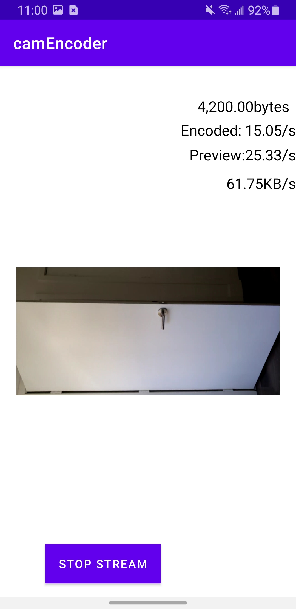

## CamEncoder

This repo demonstrates the camera streaming encoding and decoding on a Android device with MediaCodec. 
It's the video processing core of the bigger project Mobile Assist Smart Glasses [GitHub Pages](https://github.com/ohnowade/Mobile-Assisted-Smart-Glasses).
This repo provides live fps, frame size, and bandwidth requirement for streaming the video. The 
camera review is hidden and the shown view corresponding to the decoded video. The encoded video is 
also saved locally.

## Workflow
Camera View (YUV12) -> YUV420SP --\[Encode]--> H264 --\[Decode]--> YUV420P --> Surface

## Requirements
- minSDK 16
- compiledSDK 32